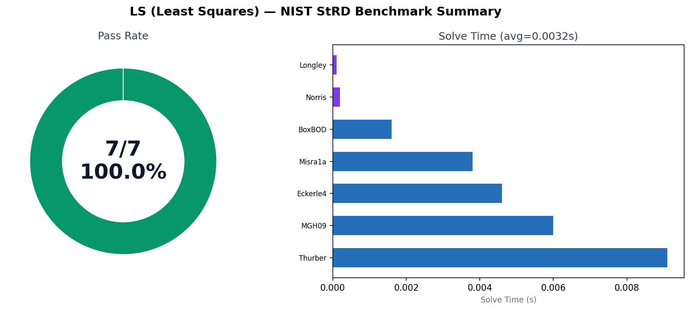
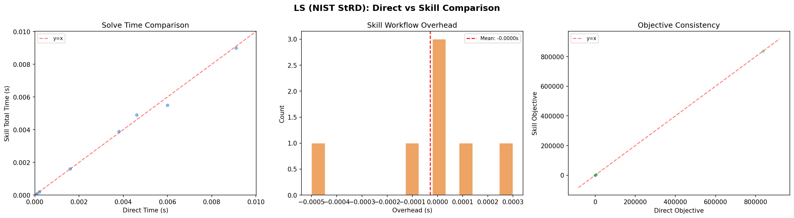

<!-- 作者：李爽夕 -->

# 最小二乘拟合

## 简介

对数据做**最小二乘回归与曲线拟合**，找到最佳参数使残差平方和最小。

$$
\min_{\theta} \sum_i (y_i - f(x_i; \theta))^2
$$

## 适用场景

- 线性回归、多项式拟合
- 自定义非线性函数拟合（指数、对数、有理函数等）
- 加权最小二乘（异方差数据）
- 正则化回归（Ridge/Lasso 防过拟合）
- 带约束拟合（参数有物理限制）
- MCMC 贝叶斯参数估计

## 快速开始

直接向 AI 提供数据点，例如：

> "对 x=[1,2,3,4,5], y=[1.2,2.1,2.9,4.0,5.1] 做线性拟合"

或指定模型：
> "用 y = a*exp(-b*x) + c 拟合以下数据..."

## 环境

```bash
pip install numpy scipy matplotlib   # 必装
```

支持 **10 种工具**：scipy.curve_fit、numpy.linalg.lstsq、scikit-learn、lmfit、cvxpy、iminuit、nlopt、jaxopt、emcee、statsmodels。无任何工具时自动从 GitHub 搜索开源代码。

## 输出格式

AI 回答包含：**环境与依赖**（工具选择及原因）→ **问题重述** → **拟合方法**（模型类型/求解器） → **拟合结果**（参数及误差） → **拟合质量**（R²/RSS/RMSE） → **诊断信息**（条件数/耗时）

## 示例

详见 [examples.md](examples.md)，含 8 个完整示例（线性、多项式、指数衰减、Ridge、加权、非线性、Lasso、有理函数拟合）。

## 基准测试

基于 NIST StRD 学术测试集（选取 7 个代表性数据集，覆盖不同难度和模型类型），对本 skill 进行验证。

| 指标 | 数值 |
|------|------|
| 测试集 | [NIST StRD](https://itl.nist.gov/div898/strd/) |
| 通过率 | **100.0%** (7/7) |
| 平均求解时间 | 0.003 s |
| 求解器 | scipy.optimize.curve_fit（经环境检测 → 优先级选择自动选定） |



### Direct vs Skill 求解对比

同一测试集（7 个 NIST StRD 数据集）上，对比**直接调用求解器 API** 和 **经由 skill 工作流求解**：

| 指标 | 直接求解 | Skill 求解 |
|------|---------|-----------|
| 通过率 | 100.0% (7/7) | 100.0% (7/7) |
| 平均求解时间 | 0.003 s | 0.003 s |
| 状态一致性 | — | 100.0% |
| 时间比 (skill/direct) | — | 1.00x |
| Skill 额外开销 | — | ~0 s（同一工具，无额外开销） |
| 选用工具 | scipy.curve_fit | scipy（经优先级链选定） |



> Skill 工作流（环境检测 → 工具选择 → 模型识别 → 拟合 → R²/RMSE 评估）的通过率和 direct 模式完全一致，开销在测量噪声范围内。

## 边界

- 能求解：线性和自定义非线性最小二乘（≤ 10^5 样本，≤ 1000 特征）
- 不能：非高斯误差模型、自动模型选择、大规模在线学习

## 数据引用

部分示例数据来自 [NIST StRD](https://itl.nist.gov/div898/strd/nls/nls_main.shtml)。美国政府公共领域数据，可自由使用，需注明来源。

