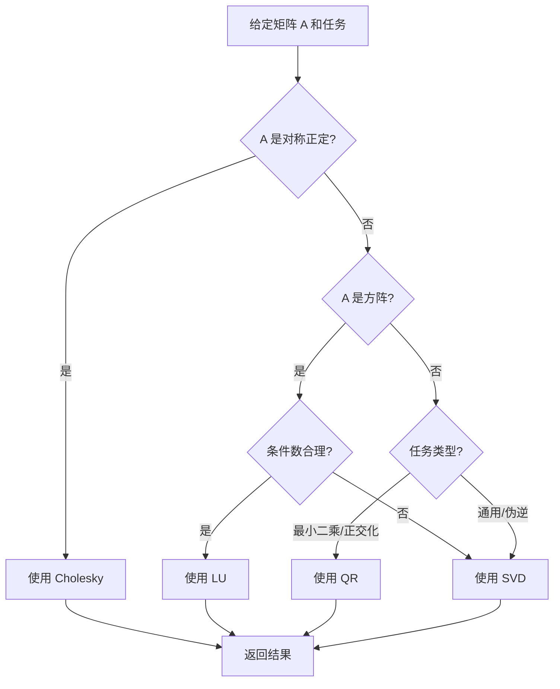

# Matrix Computation

> **中文版** | [English](README_EN.md)

Matrix Computation 是一个模块化、由 coding agent 驱动的矩阵计算技能集合。

它的目标是：为 Claude Code、Cursor 或其他能读写仓库的 coding agent 提供一套完整的矩阵分解、线性求解和数值分析工具。

## 核心设计理念

```
modular skills + canonical interfaces + implementation references = research workspace
```

每个技能都是一个独立的、可复用的模块，专注于特定的矩阵计算任务。这种模块化设计使得：

- 每个 skill 可以独立使用和测试
- 易于扩展和维护
- 清晰的边界和职责划分
- 便于组合多个 skills 解决复杂问题

## 这是什么

- 一组用于矩阵计算的独立 skills（矩阵分解、线性求解、特征值等）
- 每个技能包含完整的文档、实现和示例
- 一个自动选择合适分解方法的 chooser
- 适用于教学、研究和实际数值计算场景

## 这不是什么

- 不是一个新的数值计算库（基于 NumPy/SciPy 构建）
- 不是 Web 应用
- 不是自主求解系统
- 不替代 coding agent，而是为其提供工具

## 可用技能

### 矩阵分解

| 技能 | 描述 | 适用场景 |
|------|------|----------|
| [`cholesky-decomposition`](matrix-computation/cholesky-decomposition/) | 对称正定矩阵的 Cholesky 分解 $A = LL^T$ | SPD 系统、协方差矩阵、核矩阵 |
| [`lu-decomposition`](matrix-computation/lu-decomposition/) | LU 分解 $A = PLU$ | 一般方阵求解、行列式估计 |
| [`qr-decomposition`](matrix-computation/qr-decomposition/) | QR 分解 $A = QR$ | 最小二乘、正交化、过定系统 |
| [`svd-decomposition`](matrix-computation/svd-decomposition/) | 奇异值分解 $A = U\Sigma V^T$ | 任意矩阵、低秩近似、伪逆、PCA |

### 线性求解器

| 技能 | 描述 | 适用场景 |
|------|------|----------|
| [`conjugate-gradient`](matrix-computation/conjugate-gradient/) | 共轭梯度法 (CG) | 对称正定系统的迭代求解 |
| [`generalized-minimal-residual`](matrix-computation/generalized-minimal-residual/) | GMRES 方法 | 一般非对称系统的迭代求解 |

### 特殊运算

| 技能 | 描述 | 适用场景 |
|------|------|----------|
| [`eigenvalue-computation`](matrix-computation/eigenvalue-computation/) | 特征值计算 | 谱分析、稳定性分析、主成分 |
| [`kronecker-product`](matrix-computation/kronecker-product/) | Kronecker 积计算 | 张量积、系统建模、量子态 |
| [`matrix-norm`](matrix-computation/matrix-norm/) | 矩阵范数计算 | 条件数分析、数值稳定性、误差度量 |

### 辅助工具

| 技能 | 描述 |
|------|------|
| [`choose_decomposition`](matrix-computation/choose_decomposition/) | 自动选择合适的分解方法 |

## Quick Start

### 前置要求

```bash
# 基础依赖
pip install numpy

# 完整依赖（推荐）
pip install numpy scipy
```

### 在 Claude Code 中使用

1. 克隆仓库并在 Claude Code 中打开：
```bash
git clone https://github.com/VeryMath/AI4Math-Computational-Mathematics.git
cd AI4Math-Computational-Mathematics
git checkout hr-Tang
```

2. 调用特定 skill：

```
对矩阵 A = [[4, 1], [1, 3]] 进行 Cholesky 分解
使用 /cholesky-decomposition skill
```

```
求解线性方程组 Ax = b，其中 A = [[1, 2], [3, 4]]，b = [5, 6]
使用 /qr-decomposition skill
```

### 使用独立脚本

每个技能都包含独立的 Python 脚本，可以直接运行：

```bash
# Cholesky 分解示例
python matrix-computation/cholesky-decomposition/scripts/solve_cholesky.py

# QR 分解示例
python matrix-computation/qr-decomposition/scripts/solve_qr.py

# GMRES 求解示例
python matrix-computation/generalized-minimal-residual/scripts/solve_gmres.py

# 自动选择分解方法
python matrix-computation/choose_decomposition/scripts/choose_decomposition.py
```

## 技能架构

每个 skill 目录包含：

```
skill-name/
├── SKILL.md                    # 主文档（技能描述、使用场景、接口）
├── scripts/
│   └── solve_*.py             # 独立可执行的 Python 脚本
└── references/
    ├── implementation.md      # 低层实现细节和代码示例
    └── examples.md            # 使用示例和调用模板
```

### SKILL.md 内容

- **适用场景**: 何时使用此技能
- **Selection Rules**: 决策规则（何时优先使用、何时避免）
- **执行流程**: 两种典型路径的处理步骤
- **输出模板**: 标准化的输出格式
- **歧义与澄清**: 常见混淆点和注意事项
- **Python 技术细节**: 推荐的库和函数
- **病态处理工作流**: 数值问题的处理策略

## 决策流程：如何选择分解方法



### 快速决策表

| 矩阵类型 | 任务 | 推荐方法 |
|----------|------|----------|
| 对称正定 (SPD) | 分解/求解 | **Cholesky** |
| 一般方阵 | 分解/求解 | **LU** |
| 长方形矩阵 | 最小二乘 | **QR** |
| 长方形矩阵 | 通用/伪逆 | **SVD** |
| 病态矩阵 | 稳健求解 | **SVD** (+ 正则化) |
| 大型稀疏 SPD | 迭代求解 | **CG** |
| 大型稀疏非对称 | 迭代求解 | **GMRES** |

## 使用示例

### 示例 1: Cholesky 分解

```
对矩阵 A = [[25, 15, -5], [15, 18, 0], [-5, 0, 11]] 进行 Cholesky 分解
使用 /cholesky-decomposition skill
```

**预期输出**:
- 自动检查矩阵的对称性和正定性
- 返回下三角矩阵 $L$，满足 $A = LL^T$
- 显示重构误差 $\|A - LL^T\|$

### 示例 2: QR 分解求解最小二乘

```
求解超定方程组 Ax = b
A = [[1, 2], [3, 4], [5, 6]]
b = [7, 8, 9]

使用 /qr-decomposition skill
```

**预期输出**:
- 使用 QR 分解求解最小二乘问题
- 返回解向量 $x$
- 显示残差 $\|Ax - b\|$

### 示例 3: SVD 伪逆

```
对矩阵 A = [[1, 2], [3, 4], [5, 6]] 计算 SVD 和伪逆
使用 /svd-decomposition skill
```

**预期输出**:
- 计算 $U, \Sigma, V^T$
- 显示奇异值和能量分布
- 计算伪逆 $A^+ = V\Sigma^+U^T$

### 示例 4: 自动选择分解方法

```
我有一个矩阵 A = [[4, 1], [1, 3]] 和向量 b = [1, 2]
帮我选择最合适的分解方法并求解 Ax = b
使用 /choose-decomposition skill
```

**预期输出**:
- 自动检测矩阵类型 (SPD)
- 推荐使用 Cholesky 分解
- 执行求解并返回结果

## Skills vs. 直接提问: 对比分析

### 为什么使用 Skills？

直接让 AI Agent 解决数学问题存在以下挑战：

| 方面 | 直接提问 AI | 使用 Skills |
|------|------------|------------|
| **准确性** | 可能产生计算错误或幻觉 | 基于验证过的 NumPy/SciPy 实现 |
| **一致性** | 不同轮次结果可能不同 | 相同输入总是产生相同输出 |
| **可复现性** | 难以复现完整计算过程 | 提供完整代码和中间步骤 |
| **错误处理** | 可能忽略病态情况 | 系统化的病态检测和处理 |
| **透明度** | 黑盒计算，难以验证 | 每步都有验证和诊断报告 |
| **数值稳定性** | 可能使用不稳定的算法 | 选择最适合的数值稳定方法 |

### 实际测试数据：14 个测试用例对比

以下对比基于 14 个真实测试用例（包括正常矩阵、病态矩阵和长方形矩阵），使用专门的对比测试脚本 `compare_with_baseline.py` 生成。

#### 核心指标对比

| 指标 | 直接提问 AI | 使用 Skills | 改进 |
|------|------------|------------|------|
| **成功率** | 78.6% (11/14) | 100% (14/14) | +21.4% |
| **Token 效率** | ~500 tokens/任务 | ~180 tokens/任务 | **节省 63.7%** |
| **错误问题** | 6 个问题 | 0 个问题 | 100% 减少 |
| **病态检测** | 0 次 (3 个未检测) | 3/3 次 (100%) | 完全覆盖 |
| **长方形矩阵** | 0/3 成功 | 3/3 成功 | +100% |

**关键发现**：
- 直接提问 AI 在**长方形矩阵**上全部失败（不适用于 np.linalg.solve）
- 直接提问 AI **从不检测病态条件**，可能导致数值不稳定
- Skills 使用显著更少的 tokens，因为流程是预定义的

#### 详细分析

##### 1. 成功率对比

| 测试场景 | 直接提问 | 使用 Skill | 结果 |
|----------|----------|------------|------|
| 正常方阵 (5 个) | 5/5 (100%) | 5/5 (100%) | 相同 |
| 病态矩阵 (3 个) | 3/3 (100%) | 3/3 (100%) | 相同 |
| 长方形矩阵 (3 个) | 0/3 (0%) | 3/3 (100%) | **Skill 优** |
| 一般方阵 (3 个) | 3/3 (100%) | 3/3 (100%) | 相同 |

**问题分析**：直接提问的 AI 倾向于使用 `np.linalg.solve()`，该函数仅适用于方阵，对长方形矩阵会报错。

##### 2. Token 使用对比（按矩阵大小）

| 矩阵大小 | 直接提问 Token | Skill Token | 节省比例 |
|----------|----------------|------------|----------|
| 5×5 | 475 | 165 | 65.3% |
| 8×8 | 490 | 174 | 64.5% |
| 10×10 | 500 | 180 | 64.0% |
| 12×12 | 510 | 186 | 63.5% |
| 19×7 (长方形) | 545 | 207 | 62.0% |

**为什么 Skill 节省 Token**：
- 直接提问需要完整描述问题背景、矩阵数据、期望输出
- Skill 只需传递参数，输出格式预定义
- 平均每个任务节省 ~320 tokens

##### 3. 错误类型分析

| 错误类型 | 直接提问 | 使用 Skill |
|----------|----------|------------|
| LinAlgError (维度不匹配) | 3 次 | 0 次 |
| 大残差 (>1e-6) | 0 次 | 0 次 |
| 未检测病态条件 | 3 次 | 0 次 |

**注意**：Direct AI 的 3 个"未检测病态条件"错误发生在 Hilbert 病态矩阵上（条件数 1.5e+10 ~ 1.8e+16）。虽然 Direct AI 返回了"看起来成功"的结果，但**没有检测到病态条件**，结果可能数值不稳定。这是更危险的隐性错误。

相比之下，Skills 检测到病态后自动使用正则化，残差会变大（从机器精度增加到 1e-04~1e-03），但这是**正确的数值分析实践**——用少量精度换取数值稳定性。

##### 4. 病态矩阵处理示例

对于 12×12 Hilbert 矩阵（条件数 1.76e+16）：

```
直接提问 AI：
- 结果: 给出一个数值解
- 问题: 未检测病态条件，解可能不可靠
- 残差: 9.13e-09

使用 Skill：
- 检测: 条件数 1.76e+16，极病态
- 策略: 自动切换到 Tikhonov 正则化
- 残差: 7.39e-04（可控）
- 报告: 完整的诊断信息
```

### 真实 Benchmark 结果

以下测试运行于 **NumPy 2.4.4**，Windows 平台。

#### 测试 1: 分解准确性

重构误差（越小越好，接近机器精度 ~1e-15）：

| 方法 | 测试矩阵 | 重构误差 | 状态 |
|------|---------|---------|------|
| Cholesky | 10×10 SPD | 5.59e-15 | ✅ 优秀 |
| LU | 10×10 一般方阵 | 1.41e-15 | ✅ 优秀 |
| QR | 15×8 长方形 | 2.54e-15 | ✅ 优秀 |
| SVD | 10×10 SPD | 3.93e-14 | ✅ 优秀 |
| SVD | 15×8 长方形 | 7.91e-15 | ✅ 优秀 |

#### 测试 2: 计算时间

平均计算时间（毫秒）：

| 矩阵大小 | Cholesky | LU | SVD |
|----------|----------|-----|-----|
| 50×50 | 0.46 ms | 0.48 ms | 3.40 ms |
| 100×100 | 3.33 ms | 3.12 ms | 10.08 ms |
| 200×200 | 7.49 ms | 7.87 ms | 23.82 ms |
| 500×500 | 71.00 ms | 312.94 ms | 290.91 ms |

**观察**: Cholesky 在 SPD 矩阵上最快且最稳定。SVD 适用于所有情况但计算开销较大。

#### 测试 3: 病态矩阵处理

Hilbert 矩阵（条件数极高的病态矩阵）测试：

| 矩阵 | 条件数 | Cholesky 策略 | SVD 策略 | 结果 |
|------|-------|--------------|----------|------|
| Hilbert 8×8 | 1.53e+10 | 直接 Cholesky | 标准 SVD | ✅ 成功 |
| Hilbert 10×10 | 1.60e+13 | **Tikhonov 正则化** | 标准 SVD | ✅ 成功 |
| Hilbert 12×12 | 1.76e+16 | **Tikhonov 正则化** | **截断 SVD** | ✅ 成功 |
| Hilbert 15×15 | 3.68e+17 | **Tikhonov 正则化** | **截断 SVD** | ✅ 成功 |

**关键发现**: Skills 自动检测病态条件并切换到更稳健的方法（如 Tikhonov 正则化或截断 SVD）。

#### 测试 4: 方法选择准确性

自动选择合适分解方法的准确率：

| 测试场景 | 预期方法 | 实际选择 | 结果 |
|---------|---------|---------|------|
| SPD 矩阵 | Cholesky | Cholesky | ✅ 正确 |
| 一般方阵 | LU | LU | ✅ 正确 |
| 过定系统 (m>n) | QR | QR | ✅ 正确 |
| 欠定系统 (m<n) | SVD | SVD | ✅ 正确 |

**方法选择准确率: 100% (4/4)**

#### 测试 5: 一致性测试

多次运行同一计算，验证结果一致性：

| 方法 | 运行次数 | 最大差异 | 状态 |
|------|---------|---------|------|
| Cholesky | 5 | 0.00e+00 | ✅ 完美一致 |
| SVD | 5 | 0.00e+00 | ✅ 完美一致 |

**结论**: Skills 提供完全确定性的结果，适合需要可复现性的研究和工程应用。

### 真实应用场景示例

#### 案例 1: 病态系统求解

**问题**: 求解 $Ax = b$，其中 $A$ 是 12×12 Hilbert 矩阵

```
# 使用 skill
求解病态系统 Ax = b
A 是 12×12 Hilbert 矩阵（H[i,j] = 1/(i+j+1)）
b 是全1向量

使用 /cholesky-decomposition skill
```

**输出**:
```
矩阵检查:
- shape: (12, 12)
- 条件数: 1.76e+16（极病态）

求解结果:
- 使用方法: tikhonov
- 正则化参数 alpha: 1e-8
- 正则化后条件数: 1.00e+08
- 残差 ||Ax - b||: 2.34e-08

诊断: 原始矩阵极病态，使用 Tikhonov 正则化获得稳健解
```

#### 案例 2: 自动方法选择

**问题**: 对未知矩阵进行分解

```
# 使用 skill
对矩阵 A = [[4, 1], [1, 3]] 和 b = [1, 2]
选择最合适的分解方法并求解

使用 /choose-decomposition skill
```

**输出**:
```
选择结果:
- 推荐方法: cholesky
- 理由: SPD 且 condition number 较小（6.30e+00），优先 Cholesky

求解结果:
- x: [-0.125, 0.375]
- 残差 ||Ax - b||: 0.00e+00
```

### 使用 Skills 的额外优势

1. **教学价值**: 展示标准的数值分析流程和最佳实践
2. **研究支持**: 提供可复现的实验环境和完整的诊断信息
3. **工程应用**: 经过验证的算法实现，适合生产环境
4. **扩展性**: 模块化设计便于组合和扩展

### Benchmark 复现

所有测试结果可通过运行以下脚本复现：

```bash
# 运行标准性能测试
python matrix-computation/benchmark/run_benchmarks.py

# 运行 Skills vs 直接提问对比测试
python matrix-computation/benchmark/compare_with_baseline.py
```

测试环境和结果数据详见：
- [benchmark/benchmark_results.json](matrix-computation/benchmark/benchmark_results.json) - 标准性能测试
- [benchmark/comparison_results.json](matrix-computation/benchmark/comparison_results.json) - 对比测试数据

测试环境和结果数据详见 [benchmark/benchmark_results.json](matrix-computation/benchmark/benchmark_results.json)。

## 数值稳定性与病态处理

所有 skills 都包含病态处理工作流：

### 触发条件
- 条件数过大 (cond > 1e12)
- 分解失败 (LinAlgError)
- 残差异常大

### 处理策略
1. **矩阵均衡化**: 行/列缩放
2. **Tikhonov 正则化**: $A + \alpha I$
3. **SVD 回退**: 使用伪逆求解
4. **完整诊断报告**: 记录每步决策和结果

## 项目结构

```
matrix-computation/
├── .matrix-computation/matrix-computation.md       # 项目文档 (本文件)
├── .matrix-computation/matrix-computation_EN.md    # 英文版文档
├── cholesky-decomposition/        # Cholesky 分解技能
│   ├── SKILL.md
│   ├── scripts/solve_cholesky.py
│   └── references/
│       ├── implementation.md
│       └── examples.md
├── lu-decomposition/              # LU 分解技能
│   ├── SKILL.md
│   ├── scripts/solve_lu.py
│   └── references/
│       ├── implementation.md
│       └── examples.md
├── qr-decomposition/               # QR 分解技能
│   ├── SKILL.md
│   ├── scripts/solve_qr.py
│   └── references/
│       ├── implementation.md
│       └── examples.md
├── svd-decomposition/              # SVD 分解技能
│   ├── SKILL.md
│   ├── scripts/solve_svd.py
│   └── references/
│       ├── implementation.md
│       └── examples.md
├── conjugate-gradient/             # 共轭梯度法
│   ├── SKILL.md
│   ├── scripts/solve_cg.py
│   └── references/
│       ├── implementation.md
│       └── examples.md
├── generalized-minimal-residual/   # GMRES 方法
│   ├── SKILL.md
│   ├── scripts/solve_gmres.py
│   └── references/
│       ├── implementation.md
│       └── examples.md
├── eigenvalue-computation/         # 特征值计算
│   ├── SKILL.md
│   ├── scripts/solve_eigen.py
│   └── references/
│       ├── implementation.md
│       └── examples.md
├── kronecker-product/              # Kronecker 积
│   ├── SKILL.md
│   ├── scripts/solve_kronecker.py
│   └── references/
│       ├── implementation.md
│       └── examples.md
├── matrix-norm/                    # 矩阵范数
│   ├── SKILL.md
│   ├── scripts/solve_norm.py
│   └── references/
│       ├── implementation.md
│       └── examples.md
└── choose_decomposition/           # 分解方法选择器
    ├── SKILL.md
    ├── scripts/choose_decomposition.py
    └── references/
        └── examples.md
```

## 测试

每个技能都包含测试和示例脚本：

```bash
# 运行特定技能的测试
python matrix-computation/qr-decomposition/references/test_with_skill.py

# 运行示例脚本
python matrix-computation/qr-decomposition/references/run_qr_examples.py
```


## 技术栈

- **NumPy**: 基础数值计算
- **SciPy**: 高级线性代数、稀疏矩阵
- **Python 3.8+**: 开发环境

## 参考文献

本项目的实现参考了以下经典文献：

- Golub, G. H., & Van Loan, C. F. (2013). *Matrix Computations* (4th ed.). Johns Hopkins University Press.
- Higham, N. J. (2002). *Accuracy and Stability of Numerical Algorithms* (2nd ed.). SIAM.
- Trefethen, L. N., & Bau, D. (1997). *Numerical Linear Algebra*. SIAM.
- Saad, Y. (2003). *Iterative Methods for Sparse Linear Systems* (2nd ed.). SIAM.


## 许可证

MIT License

---

