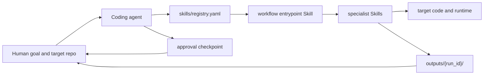

# Scientific Computing Reproduction

Chinese guide: [README.zh-CN.md](README.zh-CN.md)

`scientific-computing-reproduction` is a **Skill layer for coding agents** and a
computational math workflow package. It helps an agent reproduce computational
math research code, plan safe execution, deploy runtimes, diagnose failures,
tune parameters, create figures, and write evidence-backed summaries.

The package is Skill-first, agent-native, and conversation-first. It is not a CLI-first package and not a fully automatic pipeline: you install or load the Skills
into a coding agent, then interact in natural language while the agent reads the
Skills, inspects the target repository, writes compact review artifacts, and
waits for approval before consequential actions. Scripts are optional helpers
behind the shared Skill layer.

## What This Skill Does

This standalone skill helps a coding agent reproduce and inspect computational
mathematics research code. Use it when you have a repository, archive, paper-code
pointer, or algorithm implementation and want the agent to inspect the source,
plan a bounded run, deploy or diagnose the environment, execute only approved
steps, tune parameters when justified, create figures, and write an evidence-backed summary.

Logs, metrics, figures, and best programs are treated as computational evidence;
the README is for installing and using this skill by itself.

## What You Install

The product of this repository is the shared Skill layer under `skills/`.

A Skill is a readable workflow instruction for a coding agent. Each `SKILL.md` tells the agent when to use that workflow, what evidence to inspect, which artifacts to write, what risks require approval, and which optional helper scripts may be called.

The default entrypoint is:

```text
skills/computational_math_reproduction_workflow_skill/SKILL.md
```

The registry is:

```text
skills/registry.yaml
```

The registry routes the default workflow to specialist Skills for domain classification, repository reproduction, environment deployment, MATLAB setup, MATLAB runtime planning, failure diagnosis, tuning, visualization, human review, and report generation.

What users provide:

- a natural-language goal;
- an optional local path, remote repository, archive, or paper-code target;
- checkpoint decisions such as `approve`, `revise`, `reject`, or `skip`.

What the agent produces when useful:

- compact review artifacts under `outputs/{run_id}/`;
- command logs for approved runs;
- figures and tuning summaries when evidence exists;
- concise conversational explanations of what was found and what remains uncertain.

## Installation / Loading

Clone or open this skill repository in your coding-agent environment. Then ask
your coding agent to read:

```text
AGENTS.md
SKILL.md
skills/registry.yaml
skills/computational_math_reproduction_workflow_skill/SKILL.md
```

If your agent supports local Skill discovery, install or link the shared
`skills/` directory or the concrete workflow Skill into that agent's Skill path
and reload the agent if needed. Platform notes live in `CLAUDE.md`, `GEMINI.md`,
`.codex/INSTALL.md`, and `.opencode/INSTALL.md`.

## How It Works



The normal loop is:

1. The human asks the coding agent to use the default workflow Skill.
2. The agent reads the Skill and registry.
3. The agent inspects the target code with its native file, search, reasoning, and editing tools.
4. The agent writes `outputs/{run_id}/plan.md` before execution.
5. The human replies `approve`, `revise`, `reject`, or `skip`.
6. The agent executes only approved steps, with bounded commands and saved logs.
7. The agent writes `RUN_SUMMARY.md`, and only proposes repair or tuning when evidence supports it.

Scripts under `skills/*/scripts/` are optional tools. They can make logging, approval checks, plotting, or structured inspection easier, but they are not the user interface and they do not define the workflow.

## Install Or Load In A Coding Agent

Start by cloning or opening this repository in the coding-agent environment you want to use.

### Codex

Codex is the reference operator profile for this repository.

For local Skill discovery, link the shared Skill directory into Codex's local Skill path:

```bash
mkdir -p ~/.agents/skills
ln -s "$PWD/skills" ~/.agents/skills/ai4math
```

Restart Codex after creating or updating the link. If your Codex build discovers local Skills from `~/.codex/skills`, create the same link there and keep the directory name `ai4math`.

The Codex plugin manifest is also available at:

```text
.codex-plugin/plugin.json
```

See `.codex/INSTALL.md` for Codex-specific notes.

### Claude Code

Claude Code can use the same Skill layer through the repository files and plugin manifest:

```text
.claude-plugin/plugin.json
CLAUDE.md
```

Keep Claude-specific setup thin. The workflow remains the shared `skills/` layer.

### Cursor

Cursor plugin metadata is available at:

```text
.cursor-plugin/plugin.json
```

It points back to `skills/` and the same lightweight hooks.

### Gemini

Gemini loads the default entrypoint through:

```text
GEMINI.md
```

That file includes the workflow Skill and `skills/registry.yaml`.

### OpenCode

OpenCode can use the repository locally or through a plugin-style wrapper. See:

```text
.opencode/INSTALL.md
```

## Quick Start

After the coding agent can see the Skills, start with a prompt like this:

```text
Use computational_math_reproduction_workflow_skill.

Goal:
Inspect this computational math repository, classify the domain,
write plan.md, and wait for approval before executing anything.

Target:
<local path, repository URL, archive path, or paper-code pointer>

Output policy:
- route through skills/registry.yaml;
- keep durable artifacts under outputs/{run_id}/;
- use scripts only as optional helpers, not the workflow driver;
- ask before execution, source edits, dependency changes, long runs, tuning, or final conclusions.
```

For MATLAB access setup, ask the agent to use `matlab_environment_setup_skill` first. Use `matlab_runtime_skill` only after MATLAB, Octave, or MATLAB MCP capability is verified.

## How To Interact

Use a checkpoint loop:

```text
research-code target -> inspection -> plan -> approve / revise / reject / skip
                     -> approved run, repair, tuning, or report
                     -> evidence summary -> next checkpoint
```

Use `approve` to run a proposed step, `revise` to update the plan, `reject` to
stop the path, and `skip` to move past a phase. The agent should ask before
execution, source edits, dependency changes, long runs, tuning, or final
conclusions.

## Skill Map

- `computational_math_reproduction_workflow_skill`: default end-to-end workflow entrypoint.
- `computational_math_domain_skill`: broad computational math domain router.
- `continuous_optimization_skill`: mature specialist Skill for ADMM, PPA, proximal gradient, primal-dual methods, and augmented Lagrangian methods.
- `matlab_environment_setup_skill`: agent-neutral MATLAB, Octave, and MATLAB MCP setup and verification.
- `matlab_runtime_skill`: optional MATLAB/Octave runtime backend inspection, planning, toolbox hints, and approved execution boundary.
- `repo_reproduction_skill`: repository analysis, run planning, approved execution, and evidence collection.
- `environment_deployment_skill`: dependency and runtime setup planning.
- `failure_diagnosis_skill`: failure classification and repair planning.
- `algorithm_discovery_skill`: external algorithm and implementation discovery.
- `auto_tuning_skill`: approved tuning plans and bounded search.
- `visualization_skill`: convergence and tuning figures.
- `human_review_skill`: approval checkpoints and optional approval logs.
- `report_generation_skill`: compact plans, summaries, and reports.

## Supported Scope

Phase 1 focuses on continuous optimization research code, especially:

- ADMM;
- PPA;
- proximal gradient methods;
- primal-dual methods;
- augmented Lagrangian methods.

Python projects are the primary automatic execution target. MATLAB repositories can be inspected and planned through the MATLAB Skills, then run only after approval when MATLAB, Octave, or MATLAB MCP access is available. Julia, C++, and R are detected and reported in the MVP, but are not automatically run by default.

Other computational math areas are routed through reference cards until they need specialist Skills:

- numerical linear algebra;
- differential equations;
- PDE/FEM;
- stochastic simulation;
- inverse problems.

## Output Contract

The default workflow writes only compact durable artifacts:

- `outputs/{run_id}/plan.md` before execution;
- `outputs/{run_id}/repair_plan.md` only when source, dependency, adapter, entrypoint, or data changes are needed;
- `outputs/{run_id}/RUN_SUMMARY.md` after reproduction work;
- `outputs/{run_id}/tuning/tuning_plan.md` only when tuning is proposed;
- tuning results, tuning logs, tuning figures, and `tuning/TUNING_SUMMARY.md` only after tuning is approved.

Legacy checkpoint files and approval logs remain available as optional durable review mechanisms, but they are not the default workflow driver.

## Examples And Maintainer Material

The repository is not a reproduction case library. The `example/` directory contains compact reference artifacts that help maintainers and readers see what a completed Skill-first workflow looks like.

Tests, fixtures, and helper-script development are maintainer concerns. They are not required for a user to use the Skill layer with a coding agent.

For maintainer work, use the shared Conda environment:

```bash
conda run -n ai4math pytest
```

See `docs/environment.md`, `docs/interaction_protocol.md`, and `docs/testing.md` for maintainer details.

When adding or changing a Skill, update its `manifest.yaml`, `skills/registry.yaml`, and any routing reference cards. Keep platform adapters thin; improve the shared Skill layer first.
