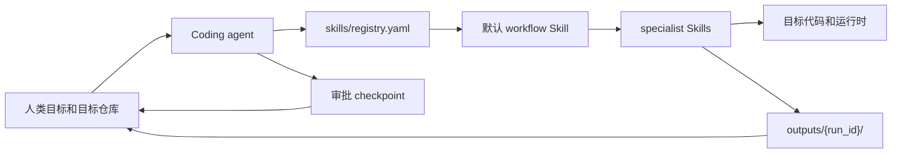

# AI4Math 计算数学 Skills

[English README](README.md)

AI4Math 计算数学 Skills 是一套 **给 coding agent 使用的 Skill 层**，也是一个
computational math workflow package。它帮助 agent 做计算数学科研代码复现、运行环境部署、
失败诊断、参数调优、可视化和证据化报告。

这个仓库是 Skill-first、agent-native、conversation-first 的。用户不通过一个打包好的 CLI pipeline 来驱动它，而是把 Skills 安装或加载到 coding agent 里，然后用自然语言和 agent 交互。Agent 会读取 Skills、检查目标仓库、写紧凑的 review 产物，并在关键操作前等待人工批准。

它不是 CLI-first package，也不是全自动 pipeline；脚本只是共享 Skill 层背后的可选辅助工具。

## 你安装的是什么

本仓库真正交付给用户的是 `skills/` 下的共享 Skill 层。

Skill 是给 coding agent 阅读的工作流说明。每个 `SKILL.md` 会告诉 agent：什么时候使用这个工作流、要检查哪些证据、要写哪些产物、哪些风险需要人工审批，以及哪些脚本可以作为可选辅助工具调用。

默认入口是：

```text
skills/computational_math_reproduction_workflow_skill/SKILL.md
```

Skill 注册表是：

```text
skills/registry.yaml
```

注册表把默认工作流路由到领域分类、仓库复现、环境部署、MATLAB 配置、MATLAB 运行时规划、失败诊断、调参、可视化、人工 review 和报告生成等 specialist Skills。

用户提供的是：

- 自然语言目标；
- 可选的本地路径、远程仓库、压缩包或论文代码目标；
- `approve`、`revise`、`reject`、`skip` 这类 checkpoint 决策。

Agent 在有价值时产出：

- `outputs/{run_id}/` 下的紧凑 review 产物；
- 获批运行的命令日志；
- 有证据时生成的图表和调参总结；
- 对发现、限制和不确定性的简洁对话说明。

## 安装 / 加载

优先从当前仓库 checkout 使用。让 coding agent 读取：

```text
AGENTS.md
SKILL.md
skills/registry.yaml
skills/computational_math_reproduction_workflow_skill/SKILL.md
```

如果目标 agent 支持本地 Skill discovery，可以把共享 `skills/` 目录或具体 workflow
Skill 安装或软链接到它的 Skill 路径，然后按需 reload 或 restart。Codex、Claude、
Gemini 和 OpenCode 的薄 adapter 分别见 `.codex/INSTALL.md`、`CLAUDE.md`、
`GEMINI.md` 和 `.opencode/INSTALL.md`。

## 它如何和 coding agent 配合



正常循环是：

1. 人类要求 coding agent 使用默认 workflow Skill。
2. Agent 读取 Skill 和 registry。
3. Agent 用自身的文件、搜索、推理和编辑能力检查目标代码。
4. Agent 在执行前写 `outputs/{run_id}/plan.md`。
5. 人类回复 `approve`、`revise`、`reject` 或 `skip`。
6. Agent 只执行获批步骤，并使用有边界的命令和保存的日志。
7. Agent 写 `RUN_SUMMARY.md`，只有证据支持时才提出 repair 或 tuning。

`skills/*/scripts/` 下的脚本只是可选工具。它们可以让日志、审批检查、画图或结构化检查更容易验证，但它们不是用户界面，也不定义工作流。

## 在 coding agent 里安装或加载

先把这个仓库 clone 或打开到你要使用的 coding-agent 环境里。

### Codex

Codex 是本仓库的参考 operator profile。

本地 Skill 发现可以把共享 Skill 目录链接到 Codex 的本地 Skill 路径：

```bash
mkdir -p ~/.agents/skills
ln -s "$PWD/skills" ~/.agents/skills/ai4math
```

创建或更新链接后重启 Codex。如果你的 Codex build 从 `~/.codex/skills` 发现本地 Skills，也在那个目录下创建同样的链接，并保持目录名为 `ai4math`。

Codex plugin manifest 位于：

```text
.codex-plugin/plugin.json
```

Codex 细节见 `.codex/INSTALL.md`。

### Claude Code

Claude Code 可以通过仓库文件和 plugin manifest 使用同一套 Skill 层：

```text
.claude-plugin/plugin.json
CLAUDE.md
```

Claude 专属配置应保持薄壳；工作流仍然以共享的 `skills/` 层为准。

### Cursor

Cursor plugin 元数据位于：

```text
.cursor-plugin/plugin.json
```

它指回 `skills/` 和同一套轻量 hooks。

### Gemini

Gemini 通过这个入口加载默认 workflow：

```text
GEMINI.md
```

该文件包含 workflow Skill 和 `skills/registry.yaml`。

### OpenCode

OpenCode 可以本地使用本仓库，也可以通过 plugin-style wrapper 加载。见：

```text
.opencode/INSTALL.md
```

## 快速开始

下面是一段最小启动 prompt。

## 第一次交互

当 coding agent 能看到这些 Skills 后，可以这样启动：

```text
Use computational_math_reproduction_workflow_skill.

Goal:
Inspect this computational math repository, classify the domain,
write plan.md, and wait for approval before executing anything.

Target:
<local path, repository URL, archive path, or paper-code pointer>

Output policy:
- route through skills/registry.yaml;
- keep durable artifacts under outputs/{run_id}/;
- use scripts only as optional helpers, not the workflow driver;
- ask before execution, source edits, dependency changes, long runs, tuning, or final conclusions.
```

如果要配置 MATLAB 访问，先让 agent 使用 `matlab_environment_setup_skill`。只有在 MATLAB、Octave 或 MATLAB MCP 能力被验证之后，再使用 `matlab_runtime_skill`。

## 如何交互使用

推荐使用 checkpoint 循环：

```text
科研代码目标 -> 检查 -> 计划 -> approve / revise / reject / skip
             -> 获批运行、修复、调参或报告
             -> 证据总结 -> 下一轮 checkpoint
```

`approve` 表示执行下一步，`revise` 表示先修改计划，`reject` 表示停止当前路线，
`skip` 表示跳过当前阶段。执行命令、源码修改、依赖变化、长时间任务、调参和最终结论前都应先问用户。

## Skill 地图

- `computational_math_reproduction_workflow_skill`：默认端到端 workflow 入口。
- `computational_math_domain_skill`：计算数学大领域路由器。
- `continuous_optimization_skill`：成熟 specialist Skill，覆盖 ADMM、PPA、proximal gradient、primal-dual methods 和 augmented Lagrangian methods。
- `matlab_environment_setup_skill`：agent-neutral 的 MATLAB、Octave 和 MATLAB MCP 配置与验证。
- `matlab_runtime_skill`：可选 MATLAB/Octave 运行时后端检查、规划、toolbox 提示和获批执行边界。
- `repo_reproduction_skill`：仓库分析、运行计划、获批执行和证据收集。
- `environment_deployment_skill`：依赖和运行环境部署规划。
- `failure_diagnosis_skill`：失败分类和修复计划。
- `algorithm_discovery_skill`：外部算法和实现发现。
- `auto_tuning_skill`：获批调参计划和有边界搜索。
- `visualization_skill`：收敛曲线和调参图表。
- `human_review_skill`：审批 checkpoint 和可选 approval logs。
- `report_generation_skill`：紧凑计划、总结和报告。

## 支持范围

Phase 1 聚焦连续优化科研代码，尤其是：

- ADMM；
- PPA；
- proximal gradient methods；
- primal-dual methods；
- augmented Lagrangian methods。

Python 项目是当前主要自动执行目标。MATLAB 仓库可以通过 MATLAB Skills 被检查和规划；只有在 MATLAB、Octave 或 MATLAB MCP 可用且获得批准后才运行。Julia、C++ 和 R 在 MVP 中会被检测和报告，但默认不自动运行。

其他计算数学方向先由 reference cards 路由，等需要时再拆成 specialist Skills：

- 数值线性代数；
- 微分方程；
- PDE/FEM；
- 随机模拟；
- 反问题。

## 输出契约

默认工作流只写紧凑的持久产物：

- 执行前写 `outputs/{run_id}/plan.md`；
- 只有需要源码、依赖、adapter、入口或数据变更时才写 `outputs/{run_id}/repair_plan.md`；
- 复现工作结束后写 `outputs/{run_id}/RUN_SUMMARY.md`；
- 只有提出调参时才写 `outputs/{run_id}/tuning/tuning_plan.md`；
- 只有调参被批准后才写 tuning results、tuning logs、tuning figures 和 `tuning/TUNING_SUMMARY.md`。

Legacy checkpoint 文件和 approval logs 仍然可以作为可选的持久 review 机制使用，但它们不是默认工作流驱动器。

## 示例和维护者材料

本仓库不是复现案例库。`example/` 目录只保留紧凑参考产物，帮助维护者和读者理解一次完整 Skill-first workflow 长什么样。

测试、fixtures 和 helper-script 开发属于维护者范围。用户通过 coding agent 使用 Skill 层时不需要它们。

维护者工作使用共享 Conda 环境：

```bash
conda run -n ai4math pytest
```

更多维护者细节见 `docs/environment.md`、`docs/interaction_protocol.md` 和 `docs/testing.md`。

新增或修改 Skill 时，需要同步更新对应的 `manifest.yaml`、`skills/registry.yaml` 和必要的 routing reference cards。平台入口保持薄壳，优先改共享 Skill 层。
