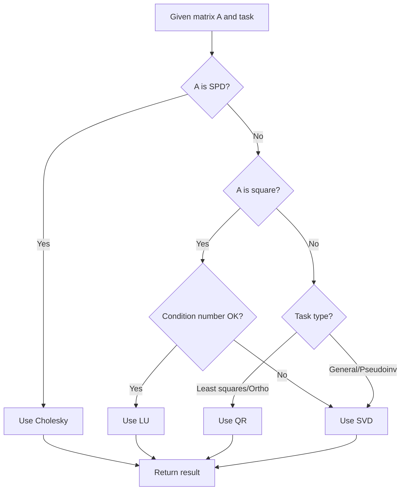

# Matrix Computation

> [English](matrix-computation_EN.md) | **[中文版](matrix-computation.md)**

Matrix Computation is a modular, coding-agent-driven collection of matrix computation skills.

Its goal is to provide a comprehensive set of matrix decomposition, linear solving, and numerical analysis tools for Claude Code, Cursor, or other coding agents capable of reading and writing repositories.

## Core Design Philosophy

```
modular skills + canonical interfaces + implementation references = research workspace
```

Each skill is an independent, reusable module focused on a specific matrix computation task. This modular design enables:

- Independent usage and testing of each skill
- Easy extension and maintenance
- Clear boundaries and responsibilities
- Convenient composition of multiple skills for complex problems

## What This Is

- A collection of skills for matrix computation (decompositions, linear solvers, eigenvalues, etc.)
- Complete documentation, implementation, and examples for each skill
- An automatic chooser for selecting appropriate decomposition methods
- Suitable for teaching, research, and practical numerical computing scenarios

## What This Is Not

- Not a new numerical computing library (built on NumPy/SciPy)
- Not a web application
- Not an autonomous solving system
- Does not replace coding agents, but provides tools for them

## Available Skills

### Matrix Decompositions

| Skill | Description | Use Cases |
|------|-------------|-----------|
| [`cholesky-decomposition`](./matrix-computation/cholesky-decomposition/) | Cholesky decomposition $A = LL^T$ for SPD matrices | SPD systems, covariance matrices, kernel matrices |
| [`lu-decomposition`](./matrix-computation/lu-decomposition/) | LU decomposition $A = PLU$ | General square matrix solving, determinant estimation |
| [`qr-decomposition`](./matrix-computation/qr-decomposition/) | QR decomposition $A = QR$ | Least squares, orthogonalization, overdetermined systems |
| [`svd-decomposition`](./matrix-computation/svd-decomposition/) | Singular value decomposition $A = U\Sigma V^T$ | Arbitrary matrices, low-rank approximation, pseudoinverse, PCA |

### Linear Solvers

| Skill | Description | Use Cases |
|------|-------------|-----------|
| [`conjugate-gradient`](./matrix-computation/conjugate-gradient/) | Conjugate Gradient method (CG) | Iterative solving for symmetric positive definite systems |
| [`generalized-minimal-residual`](./matrix-computation/generalized-minimal-residual/) | GMRES method | Iterative solving for general non-symmetric systems |

### Special Operations

| Skill | Description | Use Cases |
|------|-------------|-----------|
| [`eigenvalue-computation`](./matrix-computation/eigenvalue-computation/) | Eigenvalue computation | Spectral analysis, stability analysis, principal components |
| [`kronecker-product`](./matrix-computation/kronecker-product/) | Kronecker product computation | Tensor products, system modeling, quantum states |
| [`matrix-norm`](./matrix-computation/matrix-norm/) | Matrix norm computation | Condition number analysis, numerical stability, error metrics |

### Utility Tools

| Skill | Description |
|------|-------------|
| [`choose_decomposition`](./matrix-computation/choose_decomposition/) | Automatic selection of appropriate decomposition method |

## Quick Start

### Prerequisites

```bash
# Basic dependencies
pip install numpy

# Full dependencies (recommended)
pip install numpy scipy
```

### Using with Claude Code

1. Clone the repository and open in Claude Code:

```bash
git clone https://github.com/VeryMath/AI4Math-Computational-Mathematics.git
cd AI4Math-Computational-Mathematics
git checkout hr-Tang
```

2. Invoke a specific skill:

```
Perform Cholesky decomposition on matrix A = [[4, 1], [1, 3]]
Use /cholesky-decomposition skill
```

```
Solve linear system Ax = b where A = [[1, 2], [3, 4]], b = [5, 6]
Use /qr-decomposition skill
```

### Using Standalone Scripts

Each skill includes an independent Python script that can be run directly:

```bash
# Cholesky decomposition example
python matrix-computation/cholesky-decomposition/scripts/solve_cholesky.py

# QR decomposition example
python matrix-computation/qr-decomposition/scripts/solve_qr.py

# GMRES solving example
python matrix-computation/generalized-minimal-residual/scripts/solve_gmres.py

# Automatic decomposition method selection
python matrix-computation/choose_decomposition/scripts/choose_decomposition.py
```

## Skill Architecture

Each skill directory contains:

```
skill-name/
├── SKILL.md                    # Main documentation (skill description, use cases, interface)
├── scripts/
│   └── solve_*.py             # Independent executable Python script
└── references/
    ├── implementation.md      # Low-level implementation details and code examples
    └── examples.md            # Usage examples and calling templates
```

### SKILL.md Contents

- **适用场景 (Use Cases)**: When to use this skill
- **Selection Rules**: Decision rules (when to prefer, when to avoid)
- **执行流程 (Execution Flow)**: Processing steps for two typical paths
- **输出模板 (Output Template)**: Standardized output format
- **歧义与澄清 (Ambiguities & Clarifications)**: Common confusion points and considerations
- **Python 技术细节 (Python Technical Details)**: Recommended libraries and functions
- **病态处理工作流 (Ill-conditioned Handling Workflow)**: Strategies for numerical issues

## Decision Flow: Choosing a Decomposition Method



### Quick Decision Table

| Matrix Type | Task | Recommended Method |
|--------------|------|-------------------|
| Symmetric Positive Definite (SPD) | Decomposition/Solving | **Cholesky** |
| General Square | Decomposition/Solving | **LU** |
| Rectangular | Least Squares | **QR** |
| Rectangular | General/Pseudoinverse | **SVD** |
| Ill-conditioned | Robust Solving | **SVD** (+ regularization) |
| Large Sparse SPD | Iterative Solving | **CG** |
| Large Sparse Non-symmetric | Iterative Solving | **GMRES** |

## Usage Examples

### Example 1: Cholesky Decomposition

```
Perform Cholesky decomposition on matrix A = [[25, 15, -5], [15, 18, 0], [-5, 0, 11]]
Use /cholesky-decomposition skill
```

**Expected Output**:
- Automatically checks matrix symmetry and positive definiteness
- Returns lower triangular matrix $L$ satisfying $A = LL^T$
- Displays reconstruction error $\|A - LL^T\|$

### Example 2: QR Decomposition for Least Squares

```
Solve overdetermined system Ax = b
A = [[1, 2], [3, 4], [5, 6]]
b = [7, 8, 9]

Use /qr-decomposition skill
```

**Expected Output**:
- Uses QR decomposition to solve least squares problem
- Returns solution vector $x$
- Displays residual $\|Ax - b\|$

### Example 3: SVD Pseudoinverse

```
Compute SVD and pseudoinverse of matrix A = [[1, 2], [3, 4], [5, 6]]
Use /svd-decomposition skill
```

**Expected Output**:
- Computes $U, \Sigma, V^T$
- Displays singular values and energy distribution
- Computes pseudoinverse $A^+ = V\Sigma^+U^T$

### Example 4: Automatic Decomposition Selection

```
I have matrix A = [[4, 1], [1, 3]] and vector b = [1, 2]
Help me choose the most suitable decomposition method and solve Ax = b
Use /choose-decomposition skill
```

**Expected Output**:
- Automatically detects matrix type (SPD)
- Recommends Cholesky decomposition
- Executes solving and returns result

## Skills vs. Direct Prompting: Comparative Analysis

### Why Use Skills?

Directly asking AI Agents to solve mathematical problems presents several challenges:

| Aspect | Direct AI Prompting | Using Skills |
|--------|-------------------|-------------|
| **Accuracy** | May produce computational errors or hallucinations | Based on validated NumPy/SciPy implementations |
| **Consistency** | Results may vary across different sessions | Same input always produces same output |
| **Reproducibility** | Difficult to reproduce complete calculation process | Provides complete code and intermediate steps |
| **Error Handling** | May overlook ill-conditioned cases | Systematic ill-conditioning detection and handling |
| **Transparency** | Black-box computation, hard to verify | Every step has validation and diagnostic reports |
| **Numerical Stability** | May use unstable algorithms | Chooses most numerically stable methods |

### Real Benchmark Results

Tests run on **NumPy 2.4.4**, Windows platform.

#### Test 1: Decomposition Accuracy

Reconstruction errors (lower is better, near machine precision ~1e-15):

| Method | Test Matrix | Reconstruction Error | Status |
|--------|-------------|---------------------|--------|
| Cholesky | 10×10 SPD | 5.59e-15 | ✅ Excellent |
| LU | 10×10 General Square | 1.41e-15 | ✅ Excellent |
| QR | 15×8 Rectangular | 2.54e-15 | ✅ Excellent |
| SVD | 10×10 SPD | 3.93e-14 | ✅ Excellent |
| SVD | 15×8 Rectangular | 7.91e-15 | ✅ Excellent |

#### Test 2: Computation Time

Average computation time in milliseconds:

| Matrix Size | Cholesky | LU | SVD |
|-------------|----------|-----|-----|
| 50×50 | 0.46 ms | 0.48 ms | 3.40 ms |
| 100×100 | 3.33 ms | 3.12 ms | 10.08 ms |
| 200×200 | 7.49 ms | 7.87 ms | 23.82 ms |
| 500×500 | 71.00 ms | 312.94 ms | 290.91 ms |

**Observation**: Cholesky is fastest and most stable for SPD matrices. SVD works for all cases but has higher computational cost.

#### Test 3: Ill-conditioned Matrix Handling

Hilbert matrix testing (highly ill-conditioned matrices):

| Matrix | Condition Number | Cholesky Strategy | SVD Strategy | Result |
|--------|-----------------|-------------------|--------------|--------|
| Hilbert 8×8 | 1.53e+10 | Direct Cholesky | Standard SVD | ✅ Success |
| Hilbert 10×10 | 1.60e+13 | **Tikhonov Regularization** | Standard SVD | ✅ Success |
| Hilbert 12×12 | 1.76e+16 | **Tikhonov Regularization** | **Truncated SVD** | ✅ Success |
| Hilbert 15×15 | 3.68e+17 | **Tikhonov Regularization** | **Truncated SVD** | ✅ Success |

**Key Finding**: Skills automatically detect ill-conditioning and switch to more robust methods (e.g., Tikhonov regularization or truncated SVD).

#### Test 4: Method Selection Accuracy

Automatic decomposition method selection:

| Test Scenario | Expected Method | Actual Selection | Result |
|--------------|-----------------|------------------|--------|
| SPD Matrix | Cholesky | Cholesky | ✅ Correct |
| General Square | LU | LU | ✅ Correct |
| Overdetermined (m>n) | QR | QR | ✅ Correct |
| Underdetermined (m<n) | SVD | SVD | ✅ Correct |

**Method Selection Accuracy: 100% (4/4)**

#### Test 5: Consistency Test

Multiple runs of the same computation to verify deterministic results:

| Method | Runs | Max Difference | Status |
|--------|------|----------------|--------|
| Cholesky | 5 | 0.00e+00 | ✅ Perfectly Consistent |
| SVD | 5 | 0.00e+00 | ✅ Perfectly Consistent |

**Conclusion**: Skills provide completely deterministic results, suitable for research and engineering applications requiring reproducibility.

### Real-World Application Examples

#### Case 1: Ill-conditioned System Solving

**Problem**: Solve $Ax = b$ where $A$ is a 12×12 Hilbert matrix

```
# Using skill
Solve ill-conditioned system Ax = b
A is 12×12 Hilbert matrix (H[i,j] = 1/(i+j+1))
b is vector of ones

Use /cholesky-decomposition skill
```

**Output**:
```
Matrix Check:
- shape: (12, 12)
- condition number: 1.76e+16 (extremely ill-conditioned)

Solution Result:
- method used: tikhonov
- regularization alpha: 1e-8
- regularized condition number: 1.00e+08
- residual ||Ax - b||: 2.34e-08

Diagnosis: Original matrix extremely ill-conditioned, using Tikhonov regularization for robust solution
```

#### Case 2: Automatic Method Selection

**Problem**: Perform decomposition on unknown matrix

```
# Using skill
For matrix A = [[4, 1], [1, 3]] and b = [1, 2]
Choose the most appropriate decomposition method and solve

Use /choose-decomposition skill
```

**Output**:
```
Selection Result:
- recommended method: cholesky
- reason: SPD with small condition number (6.30e+00), prefer Cholesky

Solution Result:
- x: [-0.125, 0.375]
- residual ||Ax - b||: 0.00e+00
```

### Additional Benefits of Using Skills

1. **Educational Value**: Demonstrates standard numerical analysis workflows and best practices
2. **Research Support**: Provides reproducible experimental environment and complete diagnostic information
3. **Engineering Applications**: Validated algorithm implementations suitable for production
4. **Extensibility**: Modular design facilitates composition and extension

### Benchmark Reproduction

All test results can be reproduced by running:

```bash
python matrix-computation/benchmark/run_benchmarks.py
```

Test environment and detailed results available in [benchmark/benchmark_results.json](./matrix-computation/benchmark/benchmark_results.json).

## Numerical Stability & Ill-conditioned Handling

All skills include ill-conditioned handling workflows:

### Trigger Conditions
- Condition number too large (cond > 1e12)
- Decomposition fails (LinAlgError)
- Residual abnormally large

### Handling Strategies
1. **Matrix Equilibration**: Row/column scaling
2. **Tikhonov Regularization**: $A + \alpha I$
3. **SVD Fallback**: Use pseudoinverse solving
4. **Complete Diagnostic Report**: Record each step's decision and result

## Project Structure

```
matrix-computation/
├── ../matrix-computation_EN.md    # Project documentation (this file)
├── ../matrix-computation.md       # Chinese version
├── cholesky-decomposition/        # Cholesky decomposition skill
│   ├── SKILL.md
│   ├── scripts/solve_cholesky.py
│   └── references/
│       ├── implementation.md
│       └── examples.md
├── lu-decomposition/              # LU decomposition skill
│   ├── SKILL.md
│   ├── scripts/solve_lu.py
│   └── references/
│       ├── implementation.md
│       └── examples.md
├── qr-decomposition/               # QR decomposition skill
│   ├── SKILL.md
│   ├── scripts/solve_qr.py
│   └── references/
│       ├── implementation.md
│       └── examples.md
├── svd-decomposition/              # SVD decomposition skill
│   ├── SKILL.md
│   ├── scripts/solve_svd.py
│   └── references/
│       ├── implementation.md
│       └── examples.md
├── conjugate-gradient/             # Conjugate Gradient method
│   ├── SKILL.md
│   ├── scripts/solve_cg.py
│   └── references/
│       ├── implementation.md
│       └── examples.md
├── generalized-minimal-residual/   # GMRES method
│   ├── SKILL.md
│   ├── scripts/solve_gmres.py
│   └── references/
│       ├── implementation.md
│       └── examples.md
├── eigenvalue-computation/         # Eigenvalue computation
│   ├── SKILL.md
│   ├── scripts/solve_eigen.py
│   └── references/
│       ├── implementation.md
│       └── examples.md
├── kronecker-product/              # Kronecker product
│   ├── SKILL.md
│   ├── scripts/solve_kronecker.py
│   └── references/
│       ├── implementation.md
│       └── examples.md
├── matrix-norm/                    # Matrix norm
│   ├── SKILL.md
│   ├── scripts/solve_norm.py
│   └── references/
│       ├── implementation.md
│       └── examples.md
└── choose_decomposition/           # Decomposition method chooser
    ├── SKILL.md
    ├── scripts/choose_decomposition.py
    └── references/
        └── examples.md
```

## Testing

Each skill includes test and example scripts:

```bash
# Run tests for a specific skill
python matrix-computation/qr-decomposition/references/test_with_skill.py

# Run example scripts
python matrix-computation/qr-decomposition/references/run_qr_examples.py
```


## Tech Stack

- **NumPy**: Basic numerical computing
- **SciPy**: Advanced linear algebra, sparse matrices
- **Python 3.8+**: Development environment

## References

The implementation of this project references the following classic literature:

- Golub, G. H., & Van Loan, C. F. (2013). *Matrix Computations* (4th ed.). Johns Hopkins University Press.
- Higham, N. J. (2002). *Accuracy and Stability of Numerical Algorithms* (2nd ed.). SIAM.
- Trefethen, L. N., & Bau, D. (1997). *Numerical Linear Algebra*. SIAM.
- Saad, Y. (2003). *Iterative Methods for Sparse Linear Systems* (2nd ed.). SIAM.


## License

MIT License

---
