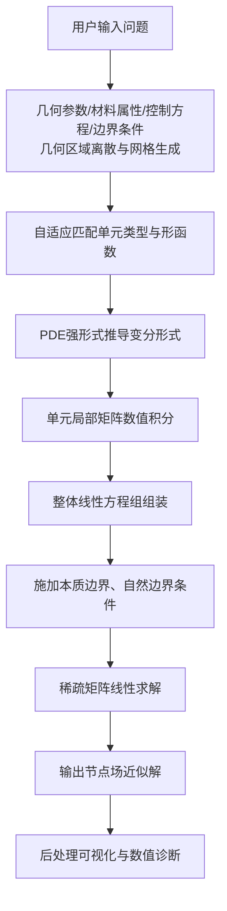

# 有限元分析

## 1. 项目概述
本工具基于伽辽金加权残差法搭建完整自动化有限元分析流程，无需依赖商用有限元软件，可自动完成几何网格离散、单元形函数匹配、偏微分方程强形式向弱形式转化、整体刚度矩阵组装与稀疏线性方程组求解。
求解结果输出节点场变量（位移、温度、势场），内置数值误差诊断模块，适用于工程快速验算、高校有限元课程教学与习题计算。


## 适用场景
1D/2D 结构静力分析（杆、平面应力/应变）

标量场问题（泊松方程、稳态热传导）

自定义线性PDE的弱形式推导

课堂练习、工程快速验算

多物理场单元选型及形函数指导

## 快速开始
直接向 AI 提供问题描述或数据：

“一根长度 1 m、截面 0.01 m² 的钢杆，E=210 GPa，左端固定，右端受拉力 1000 N，求位移和应力分布。”

或指定偏微分方程：

“在矩形域 [0,1]×[0,2] 求解泊松方程 -∇²u = 1，边界 u=0。”

## 环境
示例代码主要使用 `numpy`，更复杂的复现可按任务需要安装 `scipy`、`matplotlib`、FEniCS 或 scikit-fem。

```bash
pip install numpy scipy matplotlib
```

本仓库当前提供有限元分析提示词、流程约束与示例代码片段；不捆绑完整可执行求解器。若需要数值复现，请从 `examples.md` 中的代码片段开始，或接入本地已有的有限元库。

## 示例
详见 examples.md，含 个完整示例

## 边界
能够求解

常用单元类型：一维杆、二维三角形/四边形、三维四面体/六面体

本质边界与自然边界的自动识别与施加

常系数/变系数椭圆型PDE、对流扩散方程

不能求解

非线性、瞬态、动力问题

大变形、接触、材料非线性

## 数据引用
曾攀. 《有限元分析及应用》. 清华大学出版社.
